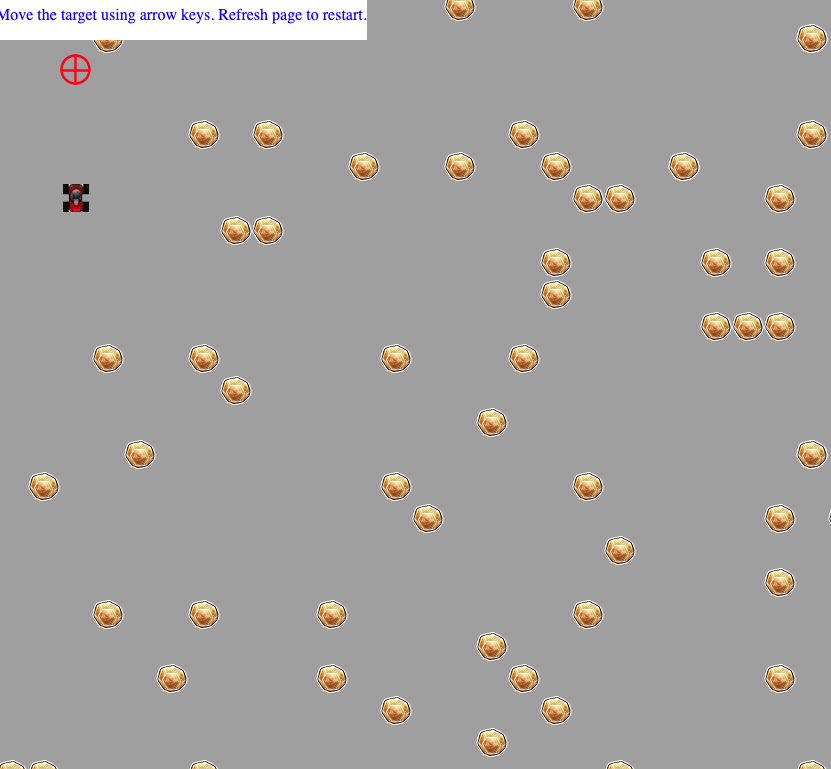
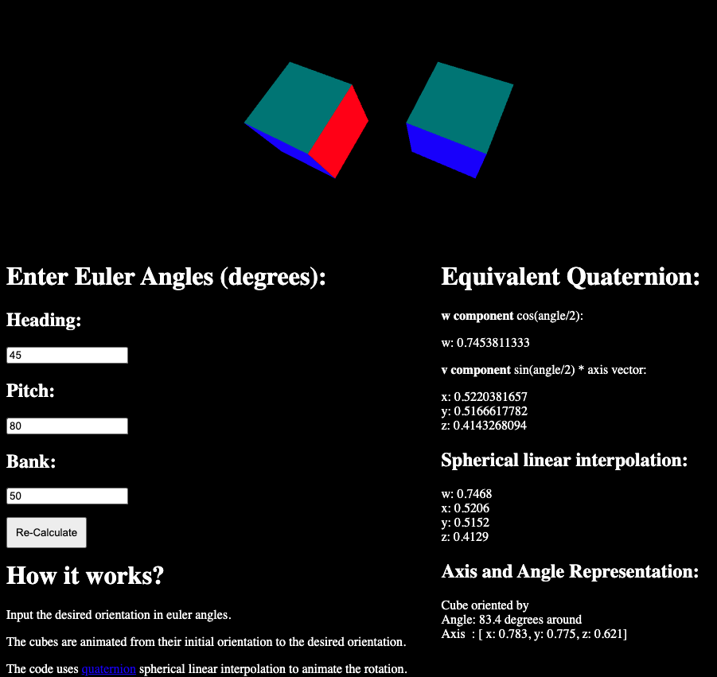
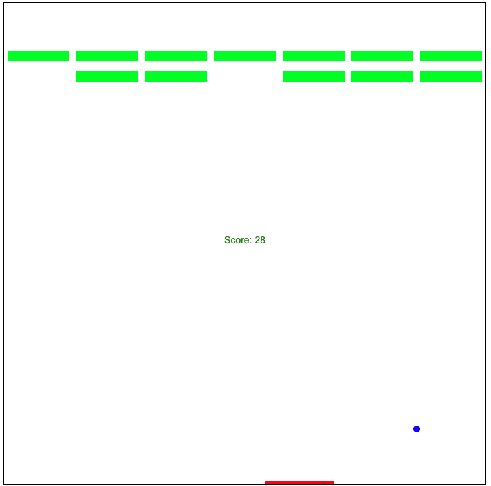
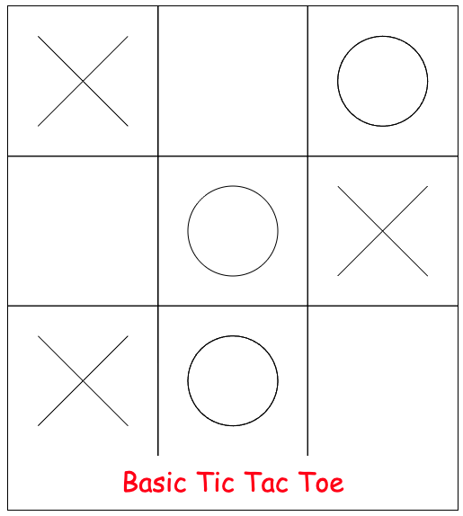

# Mini Game Demos

A collection of simple games and demos that I made several years ago while building up knowledge of game development and computer graphics.

## Projects

### movingTargetPursuit

A javascript implementation of my final year project in computer science. 

The original implementation can be found in the [MTP algorithm repository](https://github.com/abinand/xna-mtp-algo).

### quaternions
A demonstration of the quaterion equivalents of euler angles used for interpolating rotational animations.

### tileBreak
The classic tile break arcade game using html canvas and no libraries.

### TicTacToe
Tic Tac Toe with a computer player which randomly selects empty tiles.
